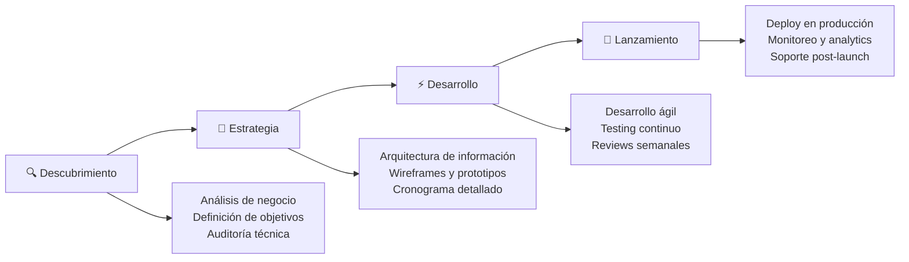

# 🚀 RJ Coders

<div align="center">


**Transformamos ideas en soluciones digitales que hacen crecer negocios**

[](https://rjcoders.com)
[](mailto:hola@rjcoders.com)
[](https://linkedin.com/company/rjcoders)

</div>

## 💡 ¿Quiénes somos?

Somos un equipo de especialistas digitales de alto rendimiento que entiende tu negocio, retos y necesidades. Creamos soluciones digitales personalizadas que inspiran, conectan y hacen crecer tu empresa.

### 🎯 Nuestros Servicios

```javascript
const rjCoders = {
  especialidades: {
    "Desarrollo a Medida": {
      descripcion: "Soluciones digitales personalizadas",
      tecnologias: ["React", "Vue.js", "Node.js", "Laravel", "Python"],
      enfoque: "Adaptadas a necesidades únicas del negocio"
    },
    "Ciberseguridad": {
      descripcion: "Protección integral contra amenazas digitales",
      servicios: ["Auditorías de seguridad", "Penetration testing", "OWASP"],
      objetivo: "Infraestructura digital blindada"
    },
    "Consultoría IA": {
      descripcion: "Integración estratégica de inteligencia artificial",
      areas: ["Automatización", "Optimización de procesos", "Machine Learning"],
      resultado: "Decisiones más inteligentes e innovación"
    }
  },
  estadisticas: {
    proyectos_exitosos: "14+",
    satisfaccion_cliente: "100%",
    metodologia: "Ágil",
    enfoque: "Proceso sistematizado"
  }
};
```

## 🛠️ Stack Tecnológico

<div align="center">

### Frontend


### Backend


### Base de Datos


### Cloud & DevOps


### Ciberseguridad & IA


</div>

## 📊 Estadísticas GitHub

<div align="center">


</div>

<div align="center">

[](https://git.io/streak-stats)

</div>

## 🚀 Nuestro Proceso Probado

<div align="center">


```mermaid
graph LR
    A[🔍 Descubrimiento] --> B[🎯 Estrategia]
    B --> C[⚡ Desarrollo]
    C --> D[🚀 Lanzamiento]
    
    A --> A1[Análisis de negocio<br/>Definición de objetivos<br/>Auditoría técnica]
    B --> B1[Arquitectura de información<br/>Wireframes y prototipos<br/>Cronograma detallado]
    C --> C1[Desarrollo ágil<br/>Testing continuo<br/>Reviews semanales]
    D --> D1[Deploy en producción<br/>Monitoreo y analytics<br/>Soporte post-launch]
```

</div>

## 💼 Casos de Éxito

<details>
<summary><strong>🏢 Proyectos Destacados (+14 exitosos)</strong></summary>

### 🎯 **Transformación Digital - Sector Inmobiliario**
- **Cliente:** Grupo Solvia
- **Tecnologías:** Laravel, Vue.js, MySQL, AWS
- **Resultado:** "El resultado final refleja profesionalidad y dedicación"

### 🏥 **Plataforma SaaS - Sector Veterinario** 
- **Cliente:** Vetlogy
- **Tecnologías:** React, Node.js, PostgreSQL, Docker
- **Impacto:** Gestión integral de clínicas veterinarias

### 📊 **Sistema de Trading - FinTech**
- **Cliente:** Cash Markets
- **Tecnologías:** Python, React, Redis, Kubernetes
- **Destacado:** "Detalle al pixel en cada pantalla"

</details>

## 🗣️ Lo que dicen nuestros clientes

<div align="center">

> *"Esta ha sido la experiencia más satisfactoria que hemos tenido con agencias. El resultado final refleja profesionalidad y dedicación."*  
> **— Fabio Boby, CEO - Grupo Solvia**

> *"Destacaría vuestro proceso de trabajo, el detalle al pixel en cada pantalla y la facilidad para comunicarnos."*  
> **— Fernando González, CEO - Cash Markets**

> *"Ha sido un placer trabajar con vosotros. Destacaría vuestra profesionalidad en la gestión del proyecto y el cumplimiento de tiempos."*  
> **— Cristian Peña, CEO - Vetlogy**

</div>

## 🤝 ¿Listo para transformar tu idea?

<div align="center">

### 📞 Hablemos de tu proyecto

[](mailto:hola@rjcoders.com)
[](https://rjcoders.com)

### 🔥 Tu visión se convierte en nuestra misión

**Proceso sistematizado • Comunicación efectiva • Cumplimiento garantizado**

</div>

## 📈 Métricas de Rendimiento

<div align="center">


</div>

## 🌟 Repositorios Destacados

<div align="center">

[](https://github.com/rjcoders/innovation-framework)
[](https://github.com/rjcoders/security-toolkit)

</div>

---

<div align="center">

### ⚡ **Code. Innovate. Secure.**

**Made with ❤️ by RJ Coders**

[](https://github.com/rjcoders)

</div>
